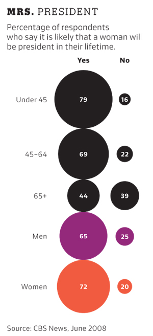

[This is the hyperlink for exercise1.8 GitHub link](https://github.com/chisunfan/compscix-415-2-assignments/blob/master/Lab1/Chisun_Fan_midterm.html)

```{r setup, include=FALSE}
knitr::opts_chunk$set(echo = TRUE)
library(tidyverse)
```


#Exercises(Total Points - 30)

##RStudio and R Markdown (3 points)
###Use markdown headers in your document to clearly separate each midterm question and add a table of contents to your document.

##The tidyverse packages (3 points)
By now you've used at least five different packages from the tidyverse for plotting, data munging, reshaping data, importing/exporting data, and using tibbles (the tibble package is used for this without you even realizing it's there).

###Can you name which package is associated with each task below?

Plotting -  
Data munging/wrangling -  
Reshaping (spreading and gathering) data - 
Importing/exporting data - 

***

**Plotting -  ggplot2**

**Data munging/wrangling -  dplyr**

**Reshaping (spreading and gathering) data - tidyr**

**Importing/exporting data - readr**

###Now can you name two functions that you’ve used from each package that you listed above for these tasks?

Plotting -   
Data munging/wrangling -  
Reshaping data -   
Importing/exporting data -  

***

**Plotting -  ggplot, geom_point**

**Data munging/wrangling -  filter  select**

**Reshaping data -  gather  separate**

**Importing/exporting data - read_csv   write_delim**

##R Basics (1.5 points)

###Fix this code with the fewest number of changes possible so it works:
My_data.name___is.too00ooLong! <- c( 1 , 2   , 3 )

***

**My_data.name___is.too00ooLong <- c( 1 , 2   , 3 )**
 
###Fix this code so it works:
my_string <- C('has', 'an', 'error', 'in', 'it)

***

**my_string <- C('has', 'an', 'error', 'in', 'it')**

###Look at the code below and comment on what happened to the values in the vector.
my_vector <- c(1, 2, '3', '4', 5)
my_vector
[1] "1" "2" "3" "4" "5"

***

**R automatically converts element in a vector to the same type when mixed types are specified. In this case it converts numeric to character type since '3' and '4' are specified character type.**

##Data import/export (3 points)

###Download the rail_trail.txt file from Canvas (in the Midterm Exam section) and successfully import it into R. Prove that it was imported successfully by including your import code and taking a glimpse of the result.
***

```{r, warning=FALSE, message=FALSE}
file_path <- "c:/users/chisun/downloads/rail_trail.txt"
csv_data=read_delim(file_path,"|")
glimpse(csv_data)
```


###Export the file into a comma-separated file and name it “rail_trail.csv”. Make sure you define the path correctly so that you know where it gets saved. Then reload the file. Include your export and import code and take another glimpse.
```{r, warning=FALSE, message=FALSE}
new_file_path="c:/users/chisun/downloads/new_rail_trail.txt"
write_delim(csv_data,delim=',',new_file_path)
new_csv_data=read_delim(new_file_path,",")
glimpse(new_csv_data)
```


##Visualization (6 points)
Critique this graphic: give only three examples of what is wrong with this graphic. Be concise.


***

**1.Mixing two categories, gender and age group, into one comparison is not good practice.**

**2.Size of circles is not as clear as bar charts for comparison**

**3.The fill color or transparency of circles does not have any clear meanings.**

###Reproduce this graphic using the diamonds data set.


```{r,warning=FALSE,message=FALSE}
ggplot(data=diamonds,mapping=aes(x=cut,y=carat,fill=color)) + geom_boxplot(position="identity") +coord_flip()
```


###The previous graphic is not very useful. We can make it much more useful by changing one thing about it. Make the change and plot it again.
```{r,warning=FALSE,message=FALSE}
ggplot(data=diamonds,mapping=aes(x=cut,y=carat,fill=color)) + geom_boxplot(position="dodge")+coord_flip()
```

***

**This plot shows median weight increases relative to its color grade regardless of cut.**

##Data munging and wrangling (6 points)

###Is this data “tidy”? If yes, leave it alone and go to the next problem. If no, make it tidy. Note: this data set is called table2 and is available in the tidyverse package. It should be ready for you to use after you’ve loaded the tidyverse package.

```{r,warning=FALSE,message=FALSE}
table2
``` 

***

```{r,warning=FALSE,message=FALSE}

spread(table2,key=type,value=count)
```

###Create a new column in the diamonds data set called price_per_carat that shows the price of each diamond per carat (hint: divide). Only show me the code, not the output.

***

**mutate(diamonds,price_per_carat=price/carat)**


###For each cut of diamond in the diamonds data set, how many diamonds, and what proportion, have a price > 10000 and a carat < 1.5? There are several ways to get to an answer, but your solution must use the data wrangling verbs from the tidyverse in order to get credit.

***

```{r,warning=FALSE,message=FALSE}
diamonds %>% group_by(cut) %>%  summarise(total=n(),select=sum((carat<1.5)&(price>10000)),proportion=sum((carat<1.5)&(price>10000))/n())
```

 
####Do the results make sense? Why?

***
**Yes. Because with weight limitation, the better the cut, the more proportion of high end diamonds in the group.** 

####Do we need to be wary of any of these numbers? Why?

***
**Yes. the ratio of "very good" cut and "premium" cut is almost identical and not follow the covariation trend.**


  

##EDA (6 points)

Take a look at the txhousing data set that is included with the ggplot2 package and answer these questions:

###During what time period is this data from?

max(txhousing$year)
[1] 2015
lastyear <- filter(txhousing, year == 2015)
max(lastyear$month)
[1] 7
min(txhousing$year)
[1] 2000
firstyear <- filter(txhousing, year == 2000)
min(firstyear$month)
[1] 1

***

**From 1/2000 to 7/2015**

###How many cities are represented?
 

```{r,warning=FALSE,message=FALSE}
txhousing %>% group_by(city) %>% count() 
```

***
**46 cities**


###Which city, month and year had the highest number of sales?

***

```{r,warning=FALSE,message=FALSE}
filter(txhousing,near(sales,max(txhousing$sales,na.rm=TRUE)))
```
**Houston July 2015**

###What kind of relationship do you think exists between the number of listings and the number of sales? Check your assumption and show your work.

***

```{r,warning=FALSE,message=FALSE} 
ggplot(txhousing,mapping=aes(x=listings,y=sales))+geom_point()+geom_smooth()
```

**The more the listing, the more the sales number.**


###What proportion of sales is missing for each city?

***

```{r,warning=FALSE,message=FALSE}
txhousing %>% group_by(city) %>% summarise(count=sum(is.na(sales)), total=n()) %>% filter(count>0) %>% mutate(percent=count/total)
```

###Looking at only the cities and months with greater than 500 sales:


####Are the distributions of the median sales price (column name median), when grouped by city, different? The same? Show your work.

***

```{r,warning=FALSE,message=FALSE}
txhousing %>% filter(sales>500)  %>% ggplot()+geom_boxplot(mapping=aes(x=reorder(city,median,mean),y=median))
```
```{r,warning=FALSE,message=FALSE}
txhousing %>% filter(sales>500)  %>% ggplot()+geom_boxplot(mapping=aes(x=reorder(month,median,mean),y=median))
```

**II's almost the same value for every month, but city to city mean value shows major difference. That prove real estate sales price is greatly affected by location**


####Any cities that stand out that you’d want to investigate further?

***

```{r,warning=FALSE,message=FALSE}

txhousing %>% filter(sales>500)  %>% filter(city == "Corpus Christi")


txhousing %>% filter(city=="Corpus Christi") %>% ggplot()+geom_col(mapping=aes(x=year,y=sales,na.rm=TRUE))

```

**Corpus Cristy appears only having very few samples.The city had a couple of hot selling years and fell off sharply after the housing crisis.**


####Why might we want to filter out all cities and months with sales less than 500?

***

```{r,warning=FALSE,message=FALSE}
txhousing  %>% ggplot()+geom_boxplot(mapping=aes(x=reorder(city,median,mean),y=median),na.rm=TRUE)
```

**The mean and median value is more reliable with sample amount over 500. Look at plot without filtering out month smaller than 500. There can be many cases where mean and median have great discrepancieds.**

##Git and Github (1.5 points)
To demonstrate your use of git and Github, at the top of your document put a hyperlink to your Github repository.

Once you are finished with your midterm, commit your final changes with the comment “finished the midterm - woohoo” and push your R Markdown file and your html or pdf file to Github.

Turn in your completed midterm
This week you should turn in your midterm by uploading it to Canvas.


 